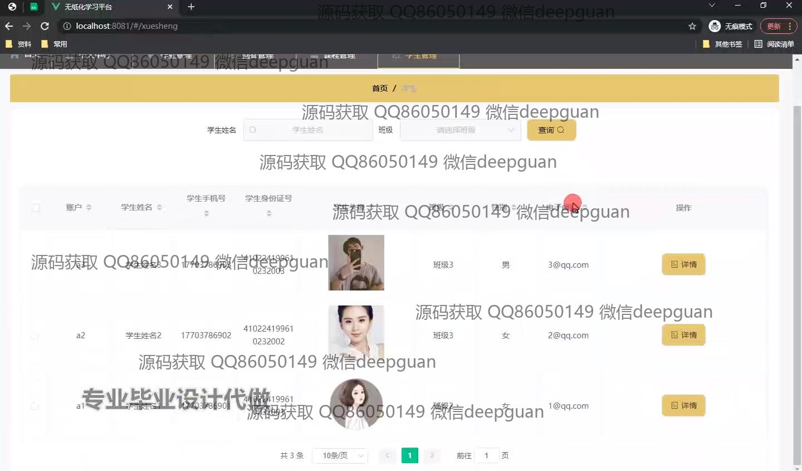

<h1 align="center">无纸化学习平台的设计与实现+vue</h1>

## 简介
无纸化学习平台：角色分为普通用户、管理员；提供首页、课程管理、个人中心、作业管理、留言板及学生信息管理功能，界面简洁，支持互动交流及高效管理。    --计算机毕业设计源码；毕设源码；java毕业设计源码

## 联系方式

<h3 align="center">获取完整代码与数据库文件 + 微信：deepguan QQ: 86050149 QQ群: 783742310</h3>

<h3 align="center">可帮忙远程部署 包运行成功！提供远程部署、修改代码、设计文档指导、代码讲解等服务！</h3>

## 功能介绍（完整见运行截图）
管理员：基本功能包括登录和多角色选择。在学生管理中，管理员可以通过姓名和班级搜索学生信息，并查看或删除作业记录。作业管理模块允许管理员管理和批改作业，查看作业详情，并通过搜索栏快速找到特定学生或作业。留言管理模块支持根据条件筛选课程留言，并提供查看和回复功能，方便进行高效的后台管理。

教师：在个人中心，教师可以管理课程，查看课程推荐列表，并收藏喜欢的课程。在作业管理模块，教师可以按作业编号或名称查询作业，查看学生作业详情，下载作业文件，以及对学生作业进行批改。平台提供了课程留言互动功能，教师可以查看和回复学生的留言，增强师生互动。

学生：学生登录后可以通过导航栏进入个人中心查看已收藏的课程，使用课程搜索功能查找感兴趣的课程，以及添加或删除收藏的内容。在作业管理中，学生可以查看和提交作业，通过条件筛选找到特定作业，并下载相关文件。留言板功能允许学生与教师或其他用户互动，通过平台进行留言和查看回复内容，促进交流。

普通用户：普通用户可以通过课程导航体验平台功能，查看系统展示的课程广告及推荐课程。用户可利用平台提供的留言功能进行沟通互动，输入和发布留言，并观察回复情况。无纸化学习平台的简洁设计提升了用户体验，确保用户能够直观使用各项功能，进行有效的学习和管理。

## 运行截图

本代码来源于网络,仅供学习参考使用!

